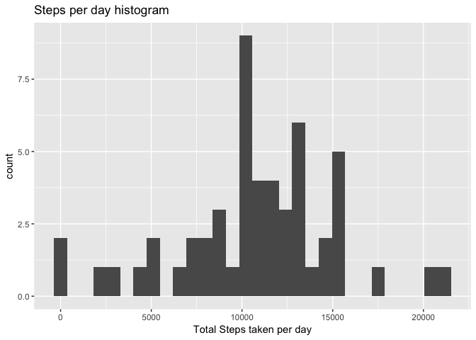
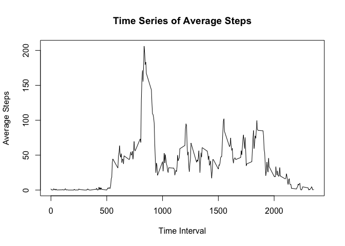
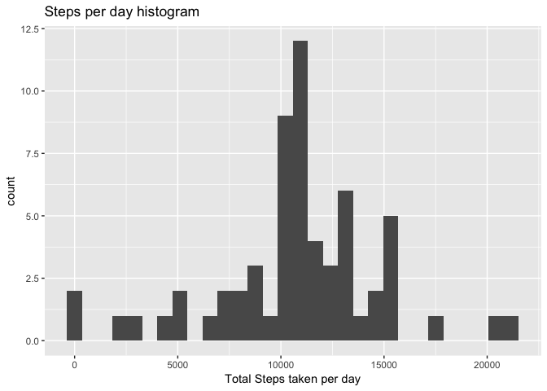
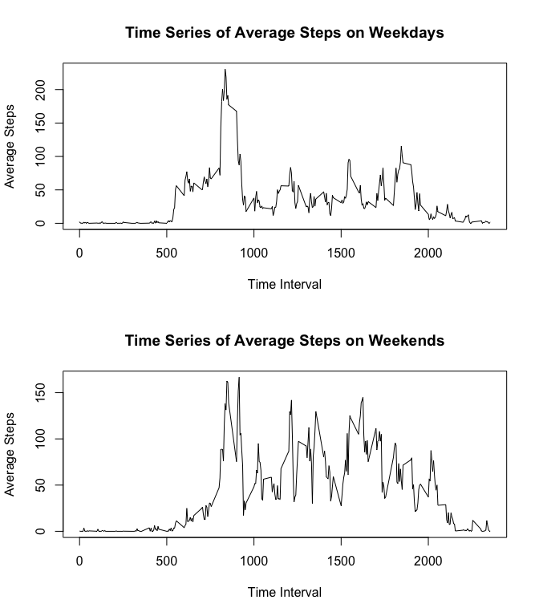

Part 1: Loading and processing data
-----------------------------------

The activity data was read into R and saved to the variable *activity*
using the following code:

    activity <- read.csv("activity.csv")

Part 2: What is mean total number of steps taken per day?
---------------------------------------------------------

1.  The total number of steps taken per day was calculated using the
    following code:

<!-- -->

    daily.sum <- tapply(activity$steps,activity$date, FUN = sum )

1.  

<!-- -->

    library(ggplot2)
    qplot(daily.sum, xlab = "Total Steps taken per day", 
          main = "Steps per day histogram")

    ## `stat_bin()` using `bins = 30`. Pick better value with `binwidth`.

    ## Warning: Removed 8 rows containing non-finite values (stat_bin).

1.  

<!-- -->

    mean <- mean(daily.sum, na.rm = TRUE)
    median <- median(daily.sum, na.rm = TRUE)

The mean number of steps per day is 1.076618910^{4} and the median is
10765.

Part 3: What is the average daily activity pattern?
---------------------------------------------------

1.  A time plot can be constructed with the following code:

<!-- -->

    # The new data frame Time.data is created by taking the mean of the steps taken for each time interval, using tapply. 
    Time.data <- as.data.frame(as.numeric(
          tapply(activity$steps,activity$interval, FUN = mean, na.rm= TRUE)))

    # Rename the column
    colnames(Time.data)<- "Mean.Steps"

    # Add a new column which is the corresponding time interval. 
    Time.data$Time <- levels(as.factor(activity$interval))

    # Use the base plotting system to create a time series. 
    with(Time.data, plot(Time, Mean.Steps, type = "l", xlab = "Time Interval", 
                         ylab = "Average Steps", 
                         main = "Time Series of Average Steps"))

1.  

<!-- -->

    Max.In<- Time.data[which(Time.data$Mean.Steps == max(Time.data$Mean.Steps)), ]

The 5 minute interval with the highest average across all days is 835.

Part 4: Imputing missing values.
--------------------------------

1.  

<!-- -->

    NA.Values <- as.list(table(is.na(activity$steps)))

The total number of missing values in the data set is 2304.

1.  The strategy used to impute the missing values was to take the
    average value for that time interval. The following code descibes
    the process:

<!-- -->

    # The interval averages need to be calculated. 
    interval.averages <- rep(sapply(split(activity$steps, activity$interval), 
                                mean, na.rm = TRUE), 
                             length(activity$steps)/
                                   length(levels(as.factor(activity$interval))))

    # Find where the missing values are. 
    NA.positions <-  which(is.na(activity$steps))

    # Create new variable containing the steps.
    steps <- activity$steps

    # Use a for loop to replace all the NA values with the average value for that 
    # interval. 
    for(i in NA.positions){steps[i] <- interval.averages[i]}

1.  A new data set called *new\_activity* can be created using the
    following code:

<!-- -->

    #  Create a new data frame. 
    date <- activity$date

    interval <- activity$interval

    new_activity <- as.data.frame(cbind(steps, date, interval))

1.  The following code is used to compare the new data set to the old
    data set:

<!-- -->

    # Create a variable containing the total number of steps each day.
    new.daily.sum <- tapply(new_activity$steps,new_activity$date, FUN = sum )

    # Call qplot on the on the new variable. 
    library(ggplot2)
    qplot(new.daily.sum, xlab = "Total Steps taken per day", 
          main = "Steps per day histogram")

    ## `stat_bin()` using `bins = 30`. Pick better value with `binwidth`.

    # Calculate new mean and median. 
    new.mean <- mean(new.daily.sum, na.rm = TRUE)
    new.median <- median(new.daily.sum, na.rm = TRUE)

The new mean number of steps per day is 1.076618910^{4} and the new
median is 1.076618910^{4}. Because of the method used to impute the
missing values, the mean has not changed, and the median is now equal to
the mean.

The total amount of steps taken per day count has increased in the
second histogram, particularly in the middle of the graph. This is due
to using the average amount of steps per day to impute the missing
values, which is 1.076618910^{4}.

Part 5: Are there differences in activity patterns between weekdays and weekends?
---------------------------------------------------------------------------------

1.  A new factor variable dictating whether it is a weekday or a weekend
    can be created with the following code:

<!-- -->

    # Create new factor variable indentifying the day of the week. 
    new_activity$date <- as.POSIXlt(activity$date)
    new_activity$day <- as.factor(weekdays(new_activity$date))

    # Create a list of all weekdays.
    weekdays <- c("Monday", "Tuesday", "Wednesday", "Thursday", "Friday")

    # Use sapply to create another new factor variable indicating whether it is a weekday or weekend. 
    new_activity$wd_we <- sapply(new_activity$day, FUN = function(x){
          if(x %in% weekdays){"Weekday"}else{"Weekend"}
          })

1.  A plot to compare the time series between the weekdays and weekends
    can be constructed with the following code;

<!-- -->

    # The new data frame Time.data2 is created by taking the mean of the steps taken for each time interval, using tapply. 
    Time.data2 <-  as.data.frame(
          with(new_activity, tapply(steps, list(interval, wd_we),
                 FUN = mean, na.rm= TRUE)))

    # Add a new column which is the corresponding time interval. 
    Time.data2$Time <- levels(as.factor(new_activity$interval))

    # Change the parameters to included two rows of plots.
    par(mfrow=c(2,1))

    # Use the base plotting system to create two time series. 
    with(Time.data2, plot(Time, Weekday, type = "l", xlab = "Time Interval", 
                         ylab = "Average Steps", 
                         main = "Time Series of Average Steps on Weekdays"))

    with(Time.data2, plot(Time, Weekend, type = "l", xlab = "Time Interval", 
                          ylab = "Average Steps", 
                          main = "Time Series of Average Steps on Weekends"))

